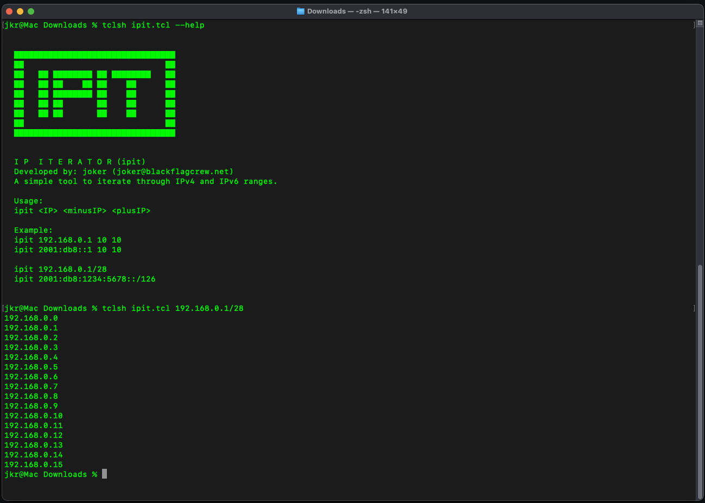

# ipit - The IP Iterator for IPv4 and IPv6

**Version 1.0**  
Developed by: **joker** ([joker@blackflagcrew.net](mailto:joker@blackflagcrew.net))  
A powerful and flexible tool to iterate through IPv4 and IPv6 ranges, supporting both incremental iteration and CIDR notation.

## Features

- Supports both **IPv4** and **IPv6**.
- Iterate through address ranges using start-point and range-based iteration.
- CIDR support for full network range listing.
- Simple command-line interface for efficient usage.



## Usage

Run `ipit` directly or using `tclsh`:

```sh
ipit -4 <IPv4> <minusIP> <plusIP>
ipit -6 <IPv6> <minusIP> <plusIP>
ipit <IPv4 CIDR>
ipit <IPv6 CIDR>
```

Or via Tclsh:

```sh
tclsh ipit.tcl -4 <IPv4> <minusIP> <plusIP>
tclsh ipit.tcl -6 <IPv6> <minusIP> <plusIP>
tclsh ipit.tcl <IPv4 CIDR>
tclsh ipit.tcl <IPv6 CIDR>
```

## Examples

### **IPv4 Iteration Example**

```sh
ipit -4 192.168.0.1 2 2
```

**Output:**
```
192.167.255.255
192.168.0.0
192.168.0.1
192.168.0.2
192.168.0.3
```

### **IPv6 Iteration Example**

```sh
ipit -6 2001:db8::1 2 2
```

**Output:**
```
2001:db7:ffff:ffff:ffff:ffff:ffff:ffff
2001:db8:0:0:0
2001:db8:0:0:1
2001:db8:0:0:2
2001:db8:0:0:3
```

### **IPv4 CIDR Example**

```sh
ipit 192.168.0.1/28
```

**Output:**
```
192.168.0.0
192.168.0.1
192.168.0.2
192.168.0.3
192.168.0.4
192.168.0.5
192.168.0.6
192.168.0.7
192.168.0.8
192.168.0.9
192.168.0.10
192.168.0.11
192.168.0.12
192.168.0.13
192.168.0.14
192.168.0.15
```

### **IPv6 CIDR Example**

```sh
ipit 2001:db8:1234:5678::/126
```

**Output:**
```
2001:db8:1234:5678:0:0:0:0
2001:db8:1234:5678:0:0:0:1
2001:db8:1234:5678:0:0:0:2
2001:db8:1234:5678:0:0:0:3
```

## Running with Tclsh

If running from a Tcl environment, execute:

```sh
tclsh ipit.tcl -4 192.168.0.1 2 2
tclsh ipit.tcl -6 2001:db8::1 2 2
tclsh ipit.tcl 192.168.0.1/28
tclsh ipit.tcl 2001:db8:1234:5678::/126
```

## Installation

- **Tcl Version:** Can be executed with `tclsh`.
- **Standalone Binary:** (Coming soon)

## License

This project is released under **MIT License** – do whatever you want with it, but please mention me. ❤️

---

> *ipit – because sometimes, you just need an IP.*
